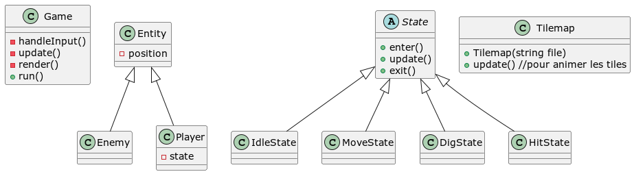
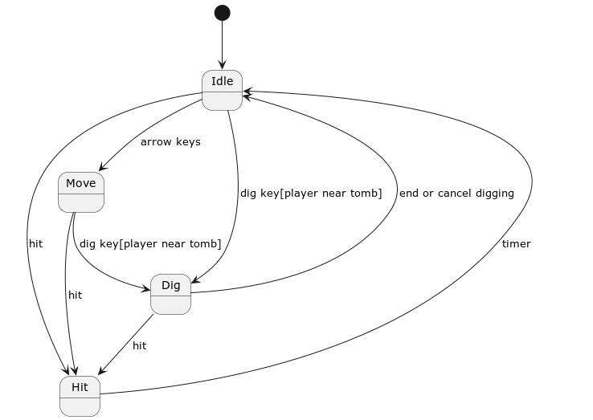

# Tomb Raiders (Do not steal)

Game Programming Pattern :
- [ ] Machine à états 
- [ ] Components
- [ ] Command pattern

Design Patterns : 
- [ ] Machine à états
- [ ] Singleton pour le joueur ?
- [ ] Command pattern
- [ ] Components (Surement pas nécessaire comme jeu assez simple)

Classes :
- [ ] Game
  - classe qui encapsule la game loop et sert d'interface 
- [ ] Entity ? 
- [ ] Player
- [ ] Enemy
- [ ] Tilemap
  - encapsulation de la classe map de tmxlite pour fonctionner avec SFML et box2D.
  
  

Diagramme d'états :

